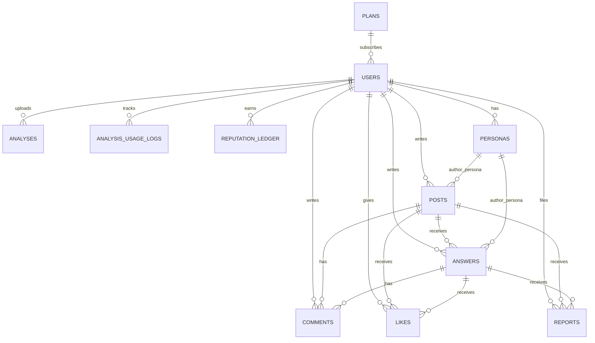

# MiriArt ERD v2.0 — MySQL 전체 스키마

> **목적**: MiriArt MySQL 데이터베이스 전체 스키마 (Cariv ERD + Legacy ERD + Community 통합)
> **버전**: 2.0 | **작성일**: 2026-02-22
> **DB 환경**: MySQL 8.x + Redis (키 설계 포함)
> **Cariv BE 참조**: `H:\n_0221\02_21dys\BE` — 패턴 참조만, 수정 없음

---

## 0. ERD 전체 관계도 (Mermaid)



---

## 1. Phase 별 테이블 목록

| 테이블 | Phase | 설명 |
|--------|-------|------|
| `users` | **P1** | 사용자 계정 (소셜 기반) |
| `plans` | **P1** | 구독 플랜 마스터 |
| `analysis_usage_logs` | **P1** | 월별 분석 사용 카운트 |
| `analyses` | **P1** | 작품 분석 결과 |
| `chat_sessions` | **P2** | AI 채팅 세션 (P1: Redis) |
| `chat_messages` | **P2** | AI 채팅 메시지 (P1: Redis) |
| `posts` | **C1** | 커뮤니티 게시글 |
| `answers` | **C1** | Q&A 답변 |
| `comments` | **C1** | 댓글 |
| `likes` | **C1** | 좋아요 |
| `personas` | **C1** | 가명 시스템 |
| `reputation_ledger` | **C1** | 평판 포인트 이력 |
| `reports` | **C4** | 신고 |

---

## 2. Phase 1 — 핵심 테이블

### 2.1 `users`

> Legacy ERD `users` + Cariv `Member` 통합. 소셜 로그인 기반으로 단순화.
> Cariv `BaseEntity` (`createdAt`, `updatedAt`) 상속 패턴 적용.

```sql
CREATE TABLE users (
    id                  BIGINT          NOT NULL AUTO_INCREMENT,
    provider            ENUM('KAKAO', 'GOOGLE') NOT NULL,
    provider_user_id    VARCHAR(100)    NOT NULL,
    email               VARCHAR(200)    NULL,
    nickname            VARCHAR(30)     NULL,
    grade               VARCHAR(20)     NULL
        COMMENT '고1/고2/고3/재수/N수',
    domain              VARCHAR(30)     NULL
        COMMENT '기초디자인/기초소양/수채화/소묘/사고의전환/만화·애니',
    role                ENUM('USER', 'ADMIN') NOT NULL DEFAULT 'USER',
    needs_profile       BOOLEAN         NOT NULL DEFAULT TRUE
        COMMENT '온보딩 완료 여부. TRUE=미완료, FALSE=완료',
    reputation_score    INT             NOT NULL DEFAULT 0,
    reputation_level    INT             NOT NULL DEFAULT 1
        COMMENT '1~12 레벨',
    created_at          TIMESTAMP       NOT NULL DEFAULT CURRENT_TIMESTAMP,
    updated_at          TIMESTAMP       NOT NULL DEFAULT CURRENT_TIMESTAMP ON UPDATE CURRENT_TIMESTAMP,
    PRIMARY KEY (id),
    UNIQUE KEY uq_provider (provider, provider_user_id),
    UNIQUE KEY uq_nickname (nickname),
    INDEX idx_email (email)
) ENGINE=InnoDB DEFAULT CHARSET=utf8mb4 COLLATE=utf8mb4_unicode_ci;
```

**Java Entity 매핑 참고**:
```java
@Entity
@Table(name = "users")
public class User extends BaseEntity {
    @Enumerated(EnumType.STRING)
    private LoginProvider provider;          // KAKAO | GOOGLE
    private String providerUserId;
    private String email;
    private String nickname;
    private String grade;
    private String domain;
    @Enumerated(EnumType.STRING)
    private UserRole role;                   // USER | ADMIN
    private boolean needsProfile = true;
    private int reputationScore = 0;
    private int reputationLevel = 1;
}
```

---

### 2.2 `plans`

> 구독 플랜 마스터 테이블. 플랜별 월 한도 관리.

```sql
CREATE TABLE plans (
    id              BIGINT          NOT NULL AUTO_INCREMENT,
    plan_type       ENUM('FREE', 'BASIC', 'PREMIUM') NOT NULL UNIQUE,
    monthly_limit   INT             NOT NULL
        COMMENT 'FREE=5, BASIC=10, PREMIUM=99999(무제한). P1 기준',
    price           INT             NOT NULL DEFAULT 0
        COMMENT '월 가격 (원). FREE=0, BASIC=19900, PREMIUM=49900',
    description     VARCHAR(200)    NULL,
    created_at      TIMESTAMP       NOT NULL DEFAULT CURRENT_TIMESTAMP,
    updated_at      TIMESTAMP       NOT NULL DEFAULT CURRENT_TIMESTAMP ON UPDATE CURRENT_TIMESTAMP,
    PRIMARY KEY (id)
) ENGINE=InnoDB DEFAULT CHARSET=utf8mb4;

-- 초기 데이터
INSERT INTO plans (plan_type, monthly_limit, price) VALUES
    ('FREE', 5, 0),
    ('BASIC', 10, 19900),
    ('PREMIUM', 99999, 49900);
```

> **v1 크레딧 설계 기준**: `users` 테이블에 `plan_type` 컬럼 없이, 향후 `user_subscriptions` 테이블로 확장.
> Phase 1에서는 모든 사용자를 `FREE`로 간주하거나, `users`에 `plan_type` 컬럼 추가로 단순 운영.
> **실제 운영**: `plans` 테이블은 미사용. `users.plan_type`(ENUM)만 사용. *mysql_erd_v1.md §4.2*

**`users` 테이블 plan 컬럼 추가 (Phase 1 단순화)**:
```sql
ALTER TABLE users
    ADD COLUMN plan_type ENUM('FREE', 'BASIC', 'PREMIUM') NOT NULL DEFAULT 'FREE'
    AFTER domain;
```

---

### 2.3 `analysis_usage_logs`

> 플랜 기반 크레딧 count 용. `user_id + billing_year_month` 기반 카운트.

```sql
CREATE TABLE analysis_usage_logs (
    id              BIGINT      NOT NULL AUTO_INCREMENT,
    user_id         BIGINT      NOT NULL,
    analysis_id     BIGINT      NULL
        COMMENT '연결된 analyses.id',
    billing_year_month  CHAR(7) NOT NULL
        COMMENT 'YYYY-MM 형식. 예: 2026-02',
    created_at      TIMESTAMP   NOT NULL DEFAULT CURRENT_TIMESTAMP,
    PRIMARY KEY (id),
    FOREIGN KEY (user_id) REFERENCES users(id) ON DELETE CASCADE,
    INDEX idx_user_month (user_id, billing_year_month)
) ENGINE=InnoDB DEFAULT CHARSET=utf8mb4;
```

**크레딧 잔여 계산 쿼리**:
```sql
SELECT COUNT(*) AS used_this_month
FROM analysis_usage_logs
WHERE user_id = ? AND billing_year_month = DATE_FORMAT(NOW(), '%Y-%m');
```

---

### 2.4 `analyses`

> Legacy ERD `analyses` 기반. `analysis_id → id` 통일. `scores`, `university_predictions` JSON 저장.

```sql
CREATE TABLE analyses (
    id                      BIGINT          NOT NULL AUTO_INCREMENT,
    user_id                 BIGINT          NOT NULL,
    gcs_url                 TEXT            NOT NULL
        COMMENT 'GCS 이미지 URL (gs://...)',
    image_url               TEXT            NOT NULL
        COMMENT '공개 접근 URL (https://storage.googleapis.com/...)',
    analysis_type           ENUM('basic', 'major') NOT NULL DEFAULT 'basic',
    problem_text            VARCHAR(500)    NULL
        COMMENT '문제/맥락 입력 (선택)',
    status                  ENUM('PENDING', 'COMPLETED', 'FAILED') NOT NULL DEFAULT 'PENDING',
    grade                   ENUM('A', 'B', 'C', 'D', 'F') NULL,
    total_score             DECIMAL(5,2)    NULL,
    scores                  JSON            NULL
        COMMENT '{"density":85,"form":80,"completion":78,"relevance":88,"thinking":79}',
    fix_scope               ENUM('StructureRebuild', 'DetailTuning') NULL,
    comment                 TEXT            NULL,
    university_predictions  JSON            NULL
        COMMENT '[{"university":"홍익대학교","major":"시각디자인","line":"HIGH","probability":68,"similarAcceptedCount":14}]',
    embedding               BLOB            NULL
        COMMENT '1408-dim 벡터 (Phase 4 유사작 검색용)',
    completed_at            TIMESTAMP       NULL,
    created_at              TIMESTAMP       NOT NULL DEFAULT CURRENT_TIMESTAMP,
    updated_at              TIMESTAMP       NOT NULL DEFAULT CURRENT_TIMESTAMP ON UPDATE CURRENT_TIMESTAMP,
    PRIMARY KEY (id),
    FOREIGN KEY (user_id) REFERENCES users(id) ON DELETE CASCADE,
    INDEX idx_user_created (user_id, created_at DESC),
    INDEX idx_user_grade (user_id, grade),
    INDEX idx_status (status)
) ENGINE=InnoDB DEFAULT CHARSET=utf8mb4 COLLATE=utf8mb4_unicode_ci;
```

> **실제 운영**: `analyses.embedding` 컬럼은 현재 DB에 없음(Phase 4 유사작 검색 설계). 실 스키마는 *mysql_erd_v1.md* 기준. `analysis_type`은 실DB varchar(10).

---

## 3. Phase 2 — AI Chat 영속화 (P1: Redis TTL로 대체)

> **Phase 1**: Redis 기반 임시 저장 (`miriart:chat:session:{sessionId}`, TTL 72h)
> **Phase 2**: 아래 테이블 활성화 + Redis는 단기 캐시로 축소

### 3.1 `chat_sessions` *(Phase 2 활성화)*

```sql
CREATE TABLE chat_sessions (
    id              BIGINT      NOT NULL AUTO_INCREMENT,
    user_id         BIGINT      NOT NULL,
    analysis_id     BIGINT      NULL
        COMMENT '연결된 작품 분석 (없으면 NULL — 일반 채팅)',
    model_type      VARCHAR(20) NOT NULL DEFAULT 'CHAT_PRO'
        COMMENT 'CHAT_PRO/FAST/THINKING/SEARCH/IMAGE_EDIT',
    title           VARCHAR(200) NULL
        COMMENT '자동 생성 또는 사용자 지정 세션 제목',
    created_at      TIMESTAMP   NOT NULL DEFAULT CURRENT_TIMESTAMP,
    updated_at      TIMESTAMP   NOT NULL DEFAULT CURRENT_TIMESTAMP ON UPDATE CURRENT_TIMESTAMP,
    PRIMARY KEY (id),
    FOREIGN KEY (user_id) REFERENCES users(id) ON DELETE CASCADE,
    FOREIGN KEY (analysis_id) REFERENCES analyses(id) ON DELETE SET NULL,
    INDEX idx_user_created (user_id, created_at DESC)
) ENGINE=InnoDB DEFAULT CHARSET=utf8mb4 COLLATE=utf8mb4_unicode_ci;
```

### 3.2 `chat_messages` *(Phase 2 활성화)*

```sql
CREATE TABLE chat_messages (
    id          BIGINT      NOT NULL AUTO_INCREMENT,
    session_id  BIGINT      NOT NULL,
    role        ENUM('USER', 'MODEL') NOT NULL,
    content     TEXT        NOT NULL,
    model_type  VARCHAR(20) NULL
        COMMENT 'MODEL 메시지에 사용된 AI 모델',
    grounding_urls  JSON    NULL
        COMMENT '["https://..."]',
    quick_replies   JSON    NULL
        COMMENT '["구도 분석", "색감 피드백"]',
    image_url   TEXT        NULL
        COMMENT 'IMAGE 타입 메시지의 이미지 URL',
    created_at  TIMESTAMP   NOT NULL DEFAULT CURRENT_TIMESTAMP,
    PRIMARY KEY (id),
    FOREIGN KEY (session_id) REFERENCES chat_sessions(id) ON DELETE CASCADE,
    INDEX idx_session_created (session_id, created_at ASC)
) ENGINE=InnoDB DEFAULT CHARSET=utf8mb4 COLLATE=utf8mb4_unicode_ci;
```

---

## 4. Phase C — Community 테이블

> Community Design v1.0 (`MIRIART_HOME_COMMUNITY_DESIGN_v1.md §6`) 기반.

### 4.1 `personas` *(Phase C1)*

> 게시판/스코프 단위 가명 시스템. 동일 `(user_id, board_scope)` 조합은 항상 같은 가명.

```sql
CREATE TABLE personas (
    id              BIGINT      NOT NULL AUTO_INCREMENT,
    user_id         BIGINT      NOT NULL,
    board_scope     VARCHAR(100) NOT NULL
        COMMENT '예: "grade:고3:domain:기초디자인" 또는 "global"',
    display_name    VARCHAR(50) NOT NULL
        COMMENT '자동 생성 가명. 예: "익명의 화가 42"',
    color_token     VARCHAR(7)  NULL
        COMMENT '프로필 컬러. 예: "#C2F970"',
    created_at      TIMESTAMP   NOT NULL DEFAULT CURRENT_TIMESTAMP,
    updated_at      TIMESTAMP   NOT NULL DEFAULT CURRENT_TIMESTAMP ON UPDATE CURRENT_TIMESTAMP,
    PRIMARY KEY (id),
    FOREIGN KEY (user_id) REFERENCES users(id) ON DELETE CASCADE,
    UNIQUE KEY uq_user_scope (user_id, board_scope)
) ENGINE=InnoDB DEFAULT CHARSET=utf8mb4 COLLATE=utf8mb4_unicode_ci;
```

---

### 4.2 `posts` *(Phase C1)*

```sql
CREATE TABLE posts (
    id              BIGINT      NOT NULL AUTO_INCREMENT,
    user_id         BIGINT      NOT NULL,
    persona_id      BIGINT      NULL
        COMMENT '익명 게시 시 연결. NULL=실명',
    type            ENUM('free', 'qna') NOT NULL DEFAULT 'free',
    status          ENUM('OPEN', 'SOLVED', 'EXPIRED', 'CLOSED') NOT NULL DEFAULT 'OPEN'
        COMMENT 'OPEN=진행중, SOLVED=채택완료, EXPIRED=마감미채택, CLOSED=관리자',
    title           VARCHAR(100) NOT NULL,
    content         TEXT        NOT NULL,
    grade_scope     VARCHAR(10) NULL
        COMMENT '대상 학년 필터. 예: 고3, 재수, all',
    domain_scope    VARCHAR(30) NULL
        COMMENT '대상 도메인 필터. 예: 기초디자인, all',
    tags            JSON        NULL
        COMMENT '["석고","톤","밀도"]',
    image_urls      JSON        NULL
        COMMENT '["https://storage.googleapis.com/..."]',
    view_count      INT         NOT NULL DEFAULT 0,
    like_count      INT         NOT NULL DEFAULT 0,
    answer_count    INT         NOT NULL DEFAULT 0,
    accepted_answer_id  BIGINT  NULL,
    deadline_at     TIMESTAMP   NULL
        COMMENT 'Q&A 마감 시간. NULL=자유글',
    created_at      TIMESTAMP   NOT NULL DEFAULT CURRENT_TIMESTAMP,
    updated_at      TIMESTAMP   NOT NULL DEFAULT CURRENT_TIMESTAMP ON UPDATE CURRENT_TIMESTAMP,
    PRIMARY KEY (id),
    FOREIGN KEY (user_id) REFERENCES users(id) ON DELETE CASCADE,
    FOREIGN KEY (persona_id) REFERENCES personas(id) ON DELETE SET NULL,
    INDEX idx_type_status (type, status),
    INDEX idx_scope_created (grade_scope, domain_scope, created_at DESC),
    INDEX idx_popularity (like_count DESC, answer_count DESC, created_at DESC)
) ENGINE=InnoDB DEFAULT CHARSET=utf8mb4 COLLATE=utf8mb4_unicode_ci;
```

---

### 4.3 `answers` *(Phase C1)*

```sql
CREATE TABLE answers (
    id          BIGINT      NOT NULL AUTO_INCREMENT,
    post_id     BIGINT      NOT NULL,
    user_id     BIGINT      NOT NULL,
    persona_id  BIGINT      NULL,
    content     TEXT        NOT NULL,
    image_urls  JSON        NULL,
    like_count  INT         NOT NULL DEFAULT 0,
    is_accepted BOOLEAN     NOT NULL DEFAULT FALSE,
    created_at  TIMESTAMP   NOT NULL DEFAULT CURRENT_TIMESTAMP,
    updated_at  TIMESTAMP   NOT NULL DEFAULT CURRENT_TIMESTAMP ON UPDATE CURRENT_TIMESTAMP,
    PRIMARY KEY (id),
    FOREIGN KEY (post_id) REFERENCES posts(id) ON DELETE CASCADE,
    FOREIGN KEY (user_id) REFERENCES users(id) ON DELETE CASCADE,
    FOREIGN KEY (persona_id) REFERENCES personas(id) ON DELETE SET NULL,
    INDEX idx_post_created (post_id, created_at ASC),
    INDEX idx_post_accepted (post_id, is_accepted)
) ENGINE=InnoDB DEFAULT CHARSET=utf8mb4 COLLATE=utf8mb4_unicode_ci;
```

---

### 4.4 `comments` *(Phase C1)*

```sql
CREATE TABLE comments (
    id          BIGINT      NOT NULL AUTO_INCREMENT,
    parent_type ENUM('post', 'answer') NOT NULL,
    parent_id   BIGINT      NOT NULL,
    user_id     BIGINT      NOT NULL,
    persona_id  BIGINT      NULL,
    content     VARCHAR(500) NOT NULL,
    created_at  TIMESTAMP   NOT NULL DEFAULT CURRENT_TIMESTAMP,
    updated_at  TIMESTAMP   NOT NULL DEFAULT CURRENT_TIMESTAMP ON UPDATE CURRENT_TIMESTAMP,
    PRIMARY KEY (id),
    FOREIGN KEY (user_id) REFERENCES users(id) ON DELETE CASCADE,
    FOREIGN KEY (persona_id) REFERENCES personas(id) ON DELETE SET NULL,
    INDEX idx_parent (parent_type, parent_id, created_at ASC)
) ENGINE=InnoDB DEFAULT CHARSET=utf8mb4 COLLATE=utf8mb4_unicode_ci;
```

---

### 4.5 `likes` *(Phase C1)*

```sql
CREATE TABLE likes (
    id          BIGINT      NOT NULL AUTO_INCREMENT,
    user_id     BIGINT      NOT NULL,
    target_type ENUM('post', 'answer', 'comment') NOT NULL,
    target_id   BIGINT      NOT NULL,
    created_at  TIMESTAMP   NOT NULL DEFAULT CURRENT_TIMESTAMP,
    PRIMARY KEY (id),
    FOREIGN KEY (user_id) REFERENCES users(id) ON DELETE CASCADE,
    UNIQUE KEY uq_like (user_id, target_type, target_id),
    INDEX idx_target (target_type, target_id)
) ENGINE=InnoDB DEFAULT CHARSET=utf8mb4 COLLATE=utf8mb4_unicode_ci;
```

---

### 4.6 `reputation_ledger` *(Phase C1)*

> 평판 포인트 이력 원장. 실제 합계는 `users.reputation_score`에 반영.

```sql
CREATE TABLE reputation_ledger (
    id          BIGINT      NOT NULL AUTO_INCREMENT,
    user_id     BIGINT      NOT NULL,
    delta       INT         NOT NULL
        COMMENT '변화량. 예: +15, -3',
    reason      VARCHAR(50) NOT NULL
        COMMENT 'answer_accepted / answer_liked / post_liked / answer_written / question_written / report_penalty / uncollected_penalty',
    ref_type    VARCHAR(20) NULL
        COMMENT 'answer / post / comment',
    ref_id      BIGINT      NULL,
    created_at  TIMESTAMP   NOT NULL DEFAULT CURRENT_TIMESTAMP,
    PRIMARY KEY (id),
    FOREIGN KEY (user_id) REFERENCES users(id) ON DELETE CASCADE,
    INDEX idx_user_created (user_id, created_at DESC)
) ENGINE=InnoDB DEFAULT CHARSET=utf8mb4 COLLATE=utf8mb4_unicode_ci;
```

**평판 포인트 룰** (Community Design v1.0 §4.1):

| reason | delta | 설명 |
|--------|-------|------|
| `question_written` | +2 | 질문 작성 |
| `answer_written` | +5 | 답변 작성 |
| `answer_accepted` | +15 | 답변 채택됨 |
| `answer_liked` | +2 | 답변에 좋아요 1개 |
| `post_liked` | +1 | 자유글에 좋아요 1개 |
| `report_penalty` | -10 | 신고 누적 3회 |
| `uncollected_penalty` | -3 | Q&A 마감 후 미채택 (질문자) |

---

### 4.7 `reports` *(Phase C4)*

```sql
CREATE TABLE reports (
    id          BIGINT      NOT NULL AUTO_INCREMENT,
    reporter_id BIGINT      NOT NULL,
    target_type ENUM('post', 'answer', 'comment') NOT NULL,
    target_id   BIGINT      NOT NULL,
    reason      VARCHAR(200) NULL,
    created_at  TIMESTAMP   NOT NULL DEFAULT CURRENT_TIMESTAMP,
    PRIMARY KEY (id),
    FOREIGN KEY (reporter_id) REFERENCES users(id) ON DELETE CASCADE,
    UNIQUE KEY uq_report (reporter_id, target_type, target_id),
    INDEX idx_target (target_type, target_id)
) ENGINE=InnoDB DEFAULT CHARSET=utf8mb4 COLLATE=utf8mb4_unicode_ci;
```

---

## 5. Redis 키 설계

| 키 패턴 | TTL | 값 | 용도 |
|--------|-----|-----|------|
| `miriart:oauth2:code:{uuid}` | 60초 | `OAuth2AuthCodePayload` JSON | OAuth2 코드 교환 (1회용) |
| `miriart:refresh:{userId}` | 7일 | refreshToken JWT string | Refresh Token 저장 (블랙리스트 관리) |
| `miriart:refresh:blacklist:{jti}` | 7일 | `"1"` | 로그아웃된 토큰 블랙리스트 |
| `miriart:chat:session:{sessionId}` | 72시간 | `ChatSessionData` JSON | Phase 1 채팅 세션 컨텍스트 |
| `miriart:chat:msg:{sessionId}` | 72시간 | `ChatMessage[]` JSON | Phase 1 채팅 메시지 이력 |
| `miriart:posts:popular:cache` | 5분 | `PostSummary[]` JSON | 인기 게시글 캐시 (Phase C) |
| `miriart:user:plan:{userId}` | 1시간 | `PlanInfo` JSON | 플랜 정보 캐시 |

---

## 6. 인덱스 전략 요약

| 테이블 | 인덱스 | 용도 |
|--------|--------|------|
| `analyses` | `(user_id, created_at DESC)` | 내 분석 목록 최신순 |
| `analyses` | `(user_id, grade)` | 등급 필터링 |
| `analysis_usage_logs` | `(user_id, billing_year_month)` | 월별 사용량 COUNT |
| `posts` | `(type, status)` | Q&A 미해결 필터 |
| `posts` | `(grade_scope, domain_scope, created_at DESC)` | 스코프별 피드 |
| `posts` | `(like_count DESC, created_at DESC)` | 인기 피드 |
| `answers` | `(post_id, created_at ASC)` | 답변 시간순 |
| `comments` | `(parent_type, parent_id, created_at ASC)` | 댓글 목록 |
| `reputation_ledger` | `(user_id, created_at DESC)` | 유저 평판 이력 |

---

## Document Metadata

| 항목 | 값 |
|------|-----|
| Version | 2.0 |
| Date | 2026-02-22 |
| Based on | Legacy ERD v1.1, Cariv ERD 패턴, Community Design v1.0 §6 |
| Phase | P1 (users/analyses/plans/usage_logs) → P2 (chat) → C (community) |
