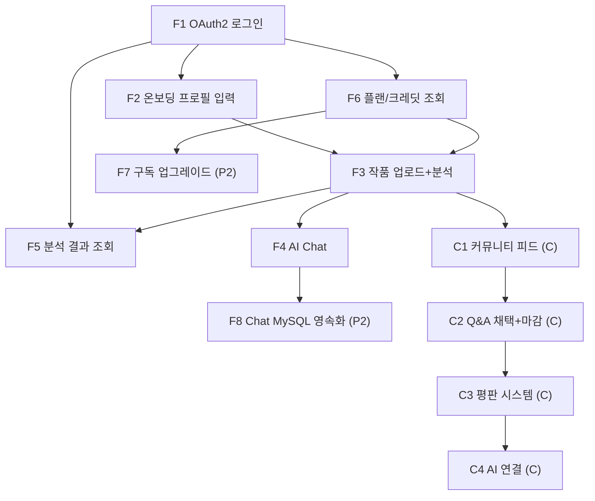

# MiriArt FSD v2.0 — 기능 명세서

> **목적**: MiriArt MVP 기능명세 (F1~F8 + Community Phase C). Phase 구분·I-P-O-E·코드 기준 검증.
> **버전**: 2.0 | **작성일**: 2026-02-22 | **최종 수정**: 2026-03-02
> **기반**: Legacy FSD v1.3, 확정 결정 세트, Community Design v1.0
> **검증 기준**: 아래 모든 “소스”는 실제 코드·파일·라인 기준. 소스는 miriart-be 실제 Java 라인 기준. 구현·예외·엔드포인트는 miriarts_infra §4.4, API_CONTRACT §9·§10 참조.
> **요청/응답 스키마·에러코드 전체·토큰 보안 전제**는 **MiriArt_API_CONTRACT.md** §1~§9 참조. 본 FSD는 기능 흐름·Process·BE 라인 위주.

**선행 조건·가정**: 모든 API(토큰·리프레시 제외)는 JWT 인증. FE는 `VITE_API_BASE_URL`로 BE만 호출. BE는 `FASTAPI_INTERNAL_URL`(miriart.fastapi.internal-url)로 AI 호출. *miriarts_infra §1.2.*

---

## 1. 기능 범위 요약

| ID | 기능명 | Phase | 우선순위 | 연결 API | 구현 상태 |
|----|--------|-------|----------|---------|-----------|
| F1 | 카카오/구글 OAuth2 로그인 | **P1** | P0 | `POST /api/auth/token` | **구현됨** |
| F2 | 온보딩 프로필 입력 | **P1** | P0 | `PATCH /api/users/me/profile` | **구현됨** |
| F3 | 작품 업로드 + AI 분석 | **P1** | P0 | `POST /api/analyses` | **구현됨** |
| F4 | AI Chat (Redis 세션 기반) | **P1** | P0 | `POST /api/chat` | **구현됨** |
| F5 | 분석 결과 조회 (Archive) | **P1** | P0 | `GET /api/analyses` | **구현됨** |
| F6 | 플랜 조회 + 크레딧 카운트 | **P1** | P1 | `GET /api/users/me/plan` | **구현됨** |
| F7 | 구독 플랜 업그레이드 UI | **P2** | P1 | 결제 연동 미정 | **미구현(향후)** |
| F8 | AI Chat MySQL 영속화 | **P2** | P2 | `chat_sessions`, `chat_messages` | **미구현(향후)** |
| C1 | 커뮤니티 피드 CRUD | **C1** | - | `GET/POST /api/posts`, answers·comments API | **일부 구현됨**(GET /api/posts만), 나머지 **미구현(향후)** |
| C2 | Q&A 채택 + 마감 자동화 | **C2** | - | `POST /api/posts/{id}/accept/{answerId}` | **미구현(향후)** |
| C3 | 평판 시스템 | **C3** | - | `ApplicationEvent` | **미구현(향후)** |
| C4 | AI 연결 (요약/초안) | **C4** | - | `/internal/ai/summarize-answers` | **미구현(향후)** |

**참조**: 구현·엔드포인트·CORS — miriarts_infra §4.2·§4.4. 예외·ErrorCode·FastAPI 명세 — API_CONTRACT §9·§10·§8. 상세 — PRD §4.1, `MiriArt_레포_전제_코드문서_정의_정리.md`.

**PRD 대응**: 본 FSD F1~F6·C1~C4는 **PRD §4.1 갭 분석·§5.1 Phase**와 1:1 대응. 플랜별 권한(Free 5회/월 등)은 **PRD §2.2**; F3 분석 한도(온보딩 완료 시 한도 스킵)·F6 getPlan으로 노출. F4 이미지편집은 현재 플랜 체크 없음, 향후 CR002·Basic 이상 적용 예정.

### 1.1 기능별 설정·인프라 의존

| 기능 | 설정·환경변수 | 인프라 | 비고 |
|------|----------------|--------|------|
| F1 | miriart.auth.cookie-same-site (prod: None), JWT secret, miriart.frontend.oauth-success-url | Redis(OAuth code 60초 TTL), JWT | *application.yml:16,19,29; application-prod.yml:44-48* |
| F2 | — | MySQL(users) | |
| F3 | miriart.fastapi.internal-url, miriart.gcs.bucket, multipart 10MB | GCS, FastAPI, MySQL(analyses, analysis_usage_logs) | *application.yml:19,24,17-18* |
| F4 | miriart.fastapi.internal-url | Redis(채팅 세션 72h), FastAPI | *miriarts_infra §4.4* |
| F5 | — | MySQL(analyses) | |
| F6 | — | MySQL(users, analysis_usage_logs) | |
| C1 | — | MySQL(posts) | GET만 구현 |

*상세: miriarts_infra §3·§4.*

### 1.2 기능별 관련 엔티티(테이블)

| 기능 | 읽기/쓰기 엔티티(테이블) | ERD 참조 |
|------|--------------------------|----------|
| F1 | users, (Redis oauth2:code) | ERD §2.1 users |
| F2 | users | ERD §2.1 |
| F3 | analyses, analysis_usage_logs, users, (GCS) | ERD §2.2 analyses, §2.3 analysis_usage_logs |
| F4 | (Redis chat:session) | — |
| F5 | analyses | ERD §2.2 |
| F6 | users, analysis_usage_logs | ERD §2.1, §2.3 |
| C1 | posts | ERD §3 posts |

*엔티티·컬럼 상세: 설계는 `MiriArt_ERD_v2.md` §2·§3. **실제 DB 스키마 SSOT**는 `mysql_erd_v1.md` (역추출·정합성 §4).*

### 1.3 용어·약어

| 용어 | 설명 |
|------|------|
| needsProfile | 온보딩 미완료(true) / 완료(false). FE 분기: true→/onboarding, false→/app/home |
| fixScope | StructureRebuild \| DetailTuning. 분석 결과·AI 멘토 분기용 |
| PlanType | FREE(5회/월), BASIC(10회/월), PREMIUM(무제한). User.planType. P1: 온보딩 전(needsProfile=true)에만 한도 적용. |
| CR001 | 이번 달 분석 한도 초과 (402) |
| AN003 | 분석 없음 또는 타인 분석 조회 (404) |

*에러코드 전체: API_CONTRACT §9.*

### 1.4 공통: 에러 시 사용자 플로우·API 버전

- **401** → FE는 `POST /api/auth/refresh` 재시도 후, 실패 시 `/auth/login` 리다이렉트. *API_CONTRACT §0.*
- **402(CR001)** → F3 업로드 시 "크레딧 부족" 안내 후 플랜/결제 유도.
- **전역 예외**(DataAccessException 미처리 등) → 500 + C003. *miriarts_infra §4.4, API_CONTRACT §10.*
- **API 버전**: 현재 버전 접두어 없음. v1 도입 시 FSD·API_CONTRACT 동시 갱신.

### 1.5 기능별 FE 라우트·화면

| 기능 | FE 라우트(대표) | 주요 화면/컴포넌트 |
|------|------------------|---------------------|
| F1 | `/auth/login` → OAuth 콜백 → `/onboarding` or `/app/home` | Login.tsx, OAuth 콜백 후 token 교환 |
| F2 | `/onboarding` | Signup.tsx (프로필 폼) |
| F3 | Upload Flow (Hero CTA / FAB) | UploadFlow, Step 3 분석 요청 |
| F4 | Chat Room | ApiService.chat(), 채팅 UI |
| F5 | Archive 탭, Result Detail | GET /api/analyses, /api/analyses/{id} |
| F6 | Home Credit Widget, Upload Step 3 | useUserStore.profile.credits, GET /api/users/me/plan |
| C1 | 커뮤니티 피드 | HomeFeed.tsx, GET /api/posts |

### 1.6 기능별 인수 조건·검증 포인트

| 기능 | 인수 조건(통과 시) | 검증 포인트 |
|------|-------------------|-------------|
| F1 | code 유효·Redis 존재 → 200 + accessToken + Set-Cookie | 토큰 저장 후 /me 200, needsProfile 분기 |
| F2 | nickname 중복 아님, grade/domain 패턴 통과 → 200 | needsProfile=false 반환, /app/home 진입 |
| F3 | 이미지 있음, 한도 내 → 202 + analysisId | 202 수신, status=PENDING, 이후 폴링/웹소켓으로 COMPLETED 확인 |
| F4 | message 필수, FastAPI 200 → 200 + text | sessionId 유지, history 연속 대화 |
| F5 | JWT 유효, 본인 분석 → 200 + 목록/단건 | 타인 id 요청 시 404(AN003) |
| F6 | JWT 유효 → 200 + plan, remaining | remaining=0 시 F3에서 CR001 예상 |
| C1 | (현재) 인증 없이 GET /api/posts → 200 | Page<PostListResponse> |

### 1.7 데이터·보안 고려사항

- **개인정보**: nickname, grade, domain은 프로필 조회·수정 시에만 노출; JWT에는 userId·role·needsProfile 수준만 포함.
- **이미지**: 업로드 파일은 GCS 버킷(서비스 계정); 외부 직접 접근 없음. 분석용으로만 FastAPI에 URL 전달.
- **채팅**: Phase 1은 Redis 72h TTL, DB 미저장; Phase 2에서 MySQL 영속화 시 보존 기간·삭제 정책 정의 필요.
- **CORS**: BE `allowedOrigins`는 miriarts_infra §4.2·SecurityConfig 기준; 프로덕션 도메인만 허용 권장.

---

## 2. Phase 1 기능 상세

### F1: 카카오/구글 OAuth2 로그인

**Trigger**: FE 로그인 화면에서 "카카오로 로그인" 또는 "구글로 로그인" 버튼 탭

**I-P-O-E 요약**

| 구분 | 내용 | 소스(파일/라인) |
|------|------|------------------|
| **Input** | FE → `POST /api/auth/token` body `TokenExchangeRequest` (code 필수). 진입은 FE `GET {BE_BASE}/oauth2/authorization/{provider}` | `AuthController.java:54-59` — `@PostMapping("/token")`, `request.getCode()`, `tokenExchangeService.exchange(request.getCode(), response)` |
| **Process** | 1. Redis `getAndDeleteOAuth2Code(code)` → 없으면 AUTH002 2. `OAuth2AuthCodePayload.fromJson` 3. `userRepository.findByIdOrThrow(payload.getUserId())` 4. `jwtUtil.createAccessToken/createRefreshToken` 5. `redisService.saveRefreshToken` 6. Set-Cookie(Refresh) 7. `TokenExchangeResponse.builder()` 반환 | `OAuth2TokenExchangeService.java:51-88` — exchange() 전부. Redis 조회 53-56, User 조회 60, JWT 64-65, Redis 저장 68, 쿠키 71-78, 빌더 82-88 |
| **Output** | `TokenExchangeResponse`: accessToken, expiresIn, userId, needsProfile, provider, **role**, **planType**. Set-Cookie: refreshToken (httpOnly, secure, path=/api/auth/refresh, maxAge=604800) | `TokenExchangeResponse.java`; 빌드 `OAuth2TokenExchangeService.java` exchange() — role, planType 포함. 컨트롤러 `AuthController.java:59` |
| **Exception** | AUTH002 — Redis code 없음/만료 시 `BusinessException(ErrorCode.OAUTH_CODE_INVALID)` | `OAuth2TokenExchangeService.java:54-56`; `ErrorCode.java:31` OAUTH_CODE_INVALID |

**FE 처리 분기**:
```
needsProfile === true  → /onboarding
needsProfile === false → /app/home
```

**인수 조건**: code 유효·Redis 존재 시 200 + accessToken + Set-Cookie; 토큰 저장 후 GET /api/users/me 200, needsProfile 분기 확인.

---

### F2: 온보딩 프로필 입력

**Trigger**: 최초 로그인 후 `needsProfile=true` 분기로 `/onboarding` 진입

**I-P-O-E 요약**

| 구분 | 내용 | 소스(파일/라인) |
|------|------|------------------|
| **Input** | `PATCH /api/users/me/profile` body `UserProfileUpdateRequest`: nickname(@NotBlank, @Size 2~20), grade(@Pattern 고1\|고2\|고3\|재수\|N수), domain(@Pattern 기초디자인\|기초소양\|…) | `UserController.java:41-45` — `@PatchMapping("/me/profile")`, `@RequestBody @Valid`; `UserProfileUpdateRequest.java:20-30` 필드·검증 |
| **Process** | 1. `userRepository.findByIdOrThrow(userId)` 2. 닉네임 중복 시 `userRepository.existsByNickname` → M002 3. `user.completeProfile(nickname, grade, domain)` 4. `UserProfileResponse.from(user)` 반환 | `UserService.java:47-60` — updateProfile(). 중복 검사 51-54, completeProfile 56, 반환 59 |
| **Output** | `UserProfileResponse` (id, nickname, grade, domain, provider, role, **planType**, reputationScore, reputationLevel, needsProfile, createdAt). FE는 needsProfile=false 시 `/app/home` | `UserService.java:59` `UserProfileResponse.from(user)`; `UserProfileResponse.java` from() — planType 포함 |
| **Exception** | M002 — 닉네임 중복 시 `BusinessException(ErrorCode.DUPLICATE_NICKNAME)`. C001 — @Valid 실패 시 GlobalExceptionHandler | `UserService.java:53`; `ErrorCode.java:40`. `GlobalExceptionHandler.java:43-48` MethodArgumentNotValidException → INVALID_INPUT_VALUE |

**현 FE 연결**: Signup.tsx formData → PATCH /api/users/me/profile  
**인수 조건**: nickname 중복 아님, grade/domain 패턴 통과 시 200; needsProfile=false 반환 후 /app/home 진입 확인.

---

### F3: 작품 업로드 + AI 분석

**Trigger**: Home 탭 Hero CTA 또는 FAB 탭 → Upload Flow 진입

**I-P-O-E 요약**

| 구분 | 내용 | 소스(파일/라인) |
|------|------|------------------|
| **Input** | `POST /api/analyses` multipart: `@RequestPart("image")` MultipartFile, `@RequestParam("analysisType")` String, `@RequestParam(value="problemText", required=false)` String | `AnalysisController.java:41-46` — startAnalysis 파라미터. Analysis 엔티티 problem_text length 500은 `Analysis.java:51-52` |
| **Process** | 1. `image == null \|\| image.isEmpty()` → F001 2. **needsProfile=true일 때만** 크레딧 한도 체크(usedThisMonth ≥ monthlyLimit → CR001). needsProfile=false면 스킵. 3. GCS 업로드 4. analyses INSERT PENDING 5. FastAPI analyze 호출 6. complete/fail + save 7. analysis_usage_logs INSERT 8. AnalysisStartResponse 반환 | `AnalysisService.java` startAnalysis() — 한도 체크 `if (user.isNeedsProfile()) { ... }`. PlanType.FREE=5. `AiProxyService.java:51-75` analyze() |
| **Output** | 202 Accepted. body `AnalysisStartResponse`: analysisId(String.valueOf(analysis.getId())), status(analysis.getStatus().name()), message(고정 "분석 중입니다. 약 8초 소요됩니다.") | `AnalysisController.java:49` `ResponseEntity.accepted().body(ApiResponse.success(result))`; `AnalysisStartResponse.java:22-27` from() |
| **Exception** | F001(64-66), CR001(73-75), F003(50-53 컨트롤러 catch IOException→FILE_UPLOAD_FAILED), AN001/AN002(AiProxyService 62-73) | `AnalysisService.java:64-66, 73-75`; `AnalysisController.java:50-53`; `ErrorCode.java:45,54,47,50-51` |

**현 FE 연결**: UploadFlow → POST /api/analyses (Authorization 헤더)

**FE 에러 처리 매핑** (AN002 = 504):
```
402(CR001) → "크레딧이 부족합니다. 플랜을 업그레이드해주세요."
504(AN002) → "분석 시간이 초과됐습니다. 잠시 후 다시 시도해주세요."
```

**비기능 제약**: 분석 응답 목표 약 8초; FastAPI 타임아웃은 WebClient 설정 기준. *API_CONTRACT·miriarts_infra.*  
**인수 조건**: 이미지 있음·한도 내 시 202 + analysisId; status=PENDING 후 COMPLETED 확인(폴링/웹소켓).

---

### F4: AI Chat (Phase 1: Redis 세션 기반)

**Trigger**: Chat Room 진입 → 메시지 입력 → Send

**I-P-O-E 요약**

| 구분 | 내용 | 소스(파일/라인) |
|------|------|------------------|
| **Input** | `POST /api/chat` body `ChatRequest`: message(@NotBlank), modelType(기본 "CHAT_PRO"), sessionId, stickyContext, imageBase64, imageMimeType, history | `AiChatController.java:37-42` — `@PostMapping`, `@RequestBody @Valid ChatRequest request`; `ChatRequest.java:22-30` 필드 |
| **Process** | 1. sessionId 없으면 UUID 생성 2. `InternalChatRequest.builder()` (modelType, message, stickyContext, history, imageBase64, imageMimeType) 3. `fastapiWebClient.post().uri("/internal/ai/chat").bodyValue(internalRequest)` 4. 5xx→AI_CHAT_FAILED, Timeout→AI_CHAT_TIMEOUT 5. 응답 수신 후 `updateSessionHistory(sessionId, chatRequest, response)` — Redis에 `[{"role":"user","text":...},{"role":"model","text":...}]` JSON 저장 6. `ChatResponse.builder()` 반환. **플랜/CR002 검사 없음** | `AiProxyService.java:83-126` chat(). 85-87 sessionId, 88-96 InternalChatRequest, 97-114 WebClient, 116-119 updateSessionHistory, 121-125 build. `AiProxyService.java:133-156` updateSessionHistory() |
| **Output** | `ChatResponse`: text, groundingUrls, quickReplies, sessionId | `AiProxyService.java:121-125` builder; `ChatResponse.java:19-23` 필드. `AiChatController.java:42` `ApiResponse.success(response)` |
| **Exception** | AI_CHAT_FAILED(5xx), AI_CHAT_TIMEOUT(30초). CR002 채팅 경로 미사용 | `AiProxyService.java:102-104, 106-107, 110-113`; `ErrorCode.java:59-60` |

**Phase 1 세션 데이터 구조** (Redis value = history 배열만; 키 `miriart:chat:session:{sessionId}`, TTL 72h):
```json
[
  { "role": "user", "text": "밀도를 어떻게..." },
  { "role": "model", "text": "밀도를 높이려면..." }
]
```
*실제 저장값은 history 배열만. sessionId/userId 등 메타는 키/별도 저장 없음.*

**비기능 제약**: FastAPI 채팅 호출 타임아웃 30초; 초과 시 AI_CHAT_TIMEOUT.  
**인수 조건**: message 필수·FastAPI 200 시 200 + text; sessionId 유지·history 연속 대화 확인.

**현 FE 연결**: `ApiService.chat(params)` → `POST /api/chat` (경로 동일) + `Authorization: Bearer` 헤더 추가

---

### F5: 분석 결과 조회 (Archive)

**Trigger**: Archive 탭 진입 또는 Result Detail 화면

**I-P-O-E 요약**

| 구분 | 내용 | 소스(파일/라인) |
|------|------|------------------|
| **Input** | JWT. 목록: `GET /api/analyses` + `@PageableDefault(size=20, sort="createdAt", direction=DESC)` Pageable. 단건: `GET /api/analyses/{id}` path Long id | `AnalysisController.java:57-62` getMyAnalyses(57-62), `64-69` getAnalysis(65-69) |
| **Process** | 목록: `analysisRepository.findByUserId(userId, pageable).map(AnalysisDetailResponse::from)`. 단건: `analysisRepository.findByIdAndUserId(analysisId, userId).orElseThrow(() -> new BusinessException(ANALYSIS_NOT_FOUND))` → `AnalysisDetailResponse.from(analysis)` | `AnalysisService.java:138-141` getMyAnalyses; `129-132` getAnalysis. `AnalysisRepository.java:19` findByUserId, `21` findByIdAndUserId |
| **Output** | 목록: `Page<AnalysisDetailResponse>`. 단건: `AnalysisDetailResponse` | `AnalysisService.java:140` map(AnalysisDetailResponse::from); `132` AnalysisDetailResponse.from(analysis). 컨트롤러 61, 68 ResponseEntity.ok(ApiResponse.success(...)) |
| **Exception** | AUTH004(401) JWT 무효. 단건 미존재/타인 → AN003(404) `BusinessException(ErrorCode.ANALYSIS_NOT_FOUND)` | `AnalysisService.java:131` orElseThrow; `ErrorCode.java:52` ANALYSIS_NOT_FOUND |

**인수 조건**: JWT 유효·본인 분석 시 200 + 목록/단건; 타인 id 요청 시 404(AN003).

**현 FE 연결**: MOCK_ARTWORKS → GET /api/analyses, GET /api/analyses/{id}

---

### F6: 플랜 조회 + 크레딧 카운트 체크

**Trigger**: Home 탭 Credit Status Widget, UploadFlow Step 3 크레딧 확인

**I-P-O-E 요약**

| 구분 | 내용 | 소스(파일/라인) |
|------|------|------------------|
| **Input** | `GET /api/users/me/plan`. JWT로 userId 주입 (`@AuthenticationPrincipal Long userId`) | `UserController.java:48-53` — `@GetMapping("/me/plan")`, getPlan(userId) |
| **Process** | 1. `analysisService.getUsedThisMonth(userId)` → `usageLogRepository.countByUserIdAndBillingYearMonth(userId, currentBillingMonth())` 2. `userService.getPlanInfo(userId, usedThisMonth)` → user.getPlanType().getMonthlyLimit(), remaining = max(0, limit - used), billingPeriodStart = LocalDate.now().withDayOfMonth(1) 3. `UserPlanResponse.builder()` 반환 | `UserController.java:52-53` getUsedThisMonth 호출, getPlanInfo 호출. `UserService.java:67-81` getPlanInfo() — 69-70 limit·remaining, 72 billingPeriodStart, 74-80 builder |
| **Output** | `UserPlanResponse`: plan(String), monthlyLimit(int), usedThisMonth(long), remaining(long), billingPeriodStart(LocalDate) | `UserPlanResponse.java:19-23` 필드; `UserService.java:74-80` builder; `UserController.java:53` ApiResponse.success(...) |
| **Exception** | AUTH004(401) — JWT 없거나 무효 시 인증 실패 | `ErrorCode.java:33` TOKEN_INVALID |

**인수 조건**: JWT 유효 시 200 + plan, monthlyLimit, usedThisMonth, remaining; remaining=0이면 F3에서 CR001 예상.

**현 FE 연결**: useUserStore.profile.credits → GET /api/users/me/plan

---

## 3. Phase 2 기능 상세

### F7: 구독 플랜 업그레이드 UI

**구현 상태**: **미구현(향후)**. Phase 2. 코드 없음. 우선순위·범위는 **PRD §5.1 Phase 2** 참조.

**설계 예정**: FE SubscriptionSheet → POST /api/subscriptions/upgrade; BE users.plan_type UPDATE; 결제 PG 미정.

---

### F8: AI Chat MySQL 영속화 전환

**구현 상태**: **미구현(향후)**. Phase 2. 현재 채팅은 Redis만 사용 (miriarts_infra §4.4). **PRD §5.1** 참조.

**설계 예정**: chat_sessions/chat_messages 테이블·Flyway; AiProxyService에 MySQL 저장; Redis 캐시 유지; GET /api/chat/sessions.

---

## 4. Phase C — 커뮤니티 기능 상세

### C1: 커뮤니티 피드 CRUD

**구현 상태**: **일부 구현됨** — GET /api/posts만. POST /api/posts, answers·comments API **미구현(향후)**. Phase C1.

**I-P-O-E 요약**

| 구분 | 내용 | 소스(파일/라인) |
|------|------|------------------|
| **Input** | (구현) `GET /api/posts` + `@PageableDefault(size=20, sort="createdAt", direction=DESC)` Pageable. (미구현) POST body type, title, content 등 | `PostController.java:31-35` — getPosts(pageable). Post 엔티티 필드는 `Post.java` |
| **Process** | (구현) `postRepository.findAll(pageable).map(PostListResponse::from)` — **사용자 필터 없음, 전체 목록** | `PostController.java:31-35`; `PostRepository` JpaRepository 기본 findAll |
| **Output** | (구현) `Page<PostListResponse>`. (미구현) 게시글 ID | `PostController.java:34` map(PostListResponse::from), 35 ApiResponse.success(page) |

**Java 도메인 패턴** (구현됨 — 엔티티·enum만):
- `PostStatus`: OPEN, SOLVED, EXPIRED, CLOSED. `PostStatus.java:10-14`
- `Post.accept(Long answerId)`: status=SOLVED, acceptedAnswerId 설정. `Post.java:104-107`
- `Post.expire()`: status=EXPIRED. `Post.java:113-114`
- 채택/마감 API·canAcceptAnswer 검사는 **미구현(C2)**.

**인수 조건**: (현재) 인증 없이 GET /api/posts 시 200 + Page<PostListResponse>.

---

### C2: Q&A 채택 + 마감 자동화

**구현 상태**: **미구현(향후)**. Phase C2. `Post.accept(Long)`, `Post.expire()` 엔티티 메서드만 존재. **PRD §5.1 Phase C** 참조.

**설계 예정**:
- **채택**: POST /api/posts/{postId}/accept/{answerId} → post.status=SOLVED, acceptedAnswerId, AnswerAcceptedEvent.
- **마감**: 배치(예: 매시) `expireDeadlinedPosts(now)` + 조회 시점 OPEN이며 deadline_at 경과 시 EXPIRED 취급.

---

### C3: 평판 시스템

**구현 상태**: **부분** — 레벨 계산만 코드에 존재. 이벤트·포인트 적립 **미구현(향후)**. **PRD §5.1 Phase C** 참조.

**구현됨 — 레벨 계산** (*User.java:95-103*):
- `User.calculateLevel(int score)`: 500→12, 300→10, 150→8, 75→6, 30→4, 10→2, 그 미만→1.
- `User.addReputation(int delta)` → reputationScore 갱신 후 calculateLevel 반영.

**설계 예정**: AnswerAcceptedEvent 발행 → @TransactionalEventListener에서 reputationService.addPoints(15 등).

---

### C4: AI 연결 (Q&A 요약/초안)

**구현 상태**: **미구현(향후)**. FastAPI에는 `/internal/ai/summarize-answers`, `/internal/ai/draft-from-question` 스텁(501)만 존재. *miriart-ai/app/routers/ai.py:51-76*. **PRD §5.1 Phase C** 참조.

**설계 예정**: FE → POST /api/posts/{id}/ai-summary → BE가 답변 수집 후 FastAPI summarize-answers → FE AiSummaryCard.

---

## 5. FE ApiService → 새 API 마이그레이션 매핑

| 현 FE (gemini.ts) | 새 엔드포인트 | 인증 | 비고 |
|-------------------|---------------|------|------|
| ApiService.analyze(file, options) | POST /api/analyses | Bearer | multipart: image, analysisType, problemText |
| ApiService.chat(params) | POST /api/chat | Bearer | ChatRequest 필드 동일 |
| ApiService.editImage(params) | POST /api/chat (modelType: IMAGE_EDIT) | Bearer | 단일 채팅 API로 통합 |

**교체**: gemini.ts → miriartApi.ts (또는 동등 모듈). analyzeArtwork 시 formData에 image, analysisType, problemText; Authorization 헤더 필수. *API_CONTRACT §11 참조.*

---

## 6. 기능 의존성 그래프



---

## Document Metadata

| 항목 | 값 |
|------|-----|
| Version | 2.0 |
| Date | 2026-03-02 |
| Based on | Legacy FSD v1.3, Community Design v1.0, API_CONTRACT, miriarts_infra, PRD §4.1·§5.1, ERD_v2, 코드베이스 |
| Phase | P1 (F1~F6) / P2 (F7~F8) / C (C1~C4) |
| 검증 | I-P-O-E별 **miriart-be 실제 Java 라인** 명시(컨트롤러·서비스·DTO·Repository). 구현/설계/미구현 구분. |
| BE 코드 정합 (최종) | F1 AuthController 54-59 + OAuth2TokenExchangeService 51-88. F2 UserController 41-45 + UserService 47-60. F3 AnalysisController 41-55 + AnalysisService 59-121. F4 AiChatController 37-42 + AiProxyService 83-126·133-156. F5 AnalysisController 57-62·65-69 + AnalysisService 129-132·138-141 + AnalysisRepository 19·21. F6 UserController 48-53 + UserService 67-81. C1 PostController 31-35 + findAll(pageable). |
| 문서 갱신 규칙 | BE/API/인프라 변경 시: (1) 해당 기능 I-P-O-E·소스 라인 반영, (2) API_CONTRACT §9·§10·엔드포인트 목록 동기화, (3) miriarts_infra §4.4 구현 현황 필요 시 수정. PRD Phase 변경 시 §1 표·F7/F8/C2~C4 구현 상태·PRD 참조 문구 갱신. |
